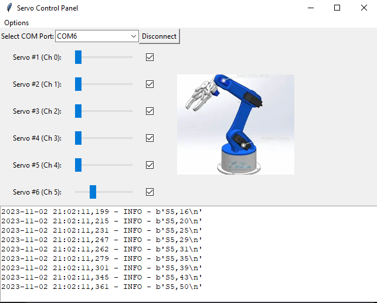

# six-dof-arduino-arm
A 3D Printed Robot Arm Controller Using cheapest components possible: Arduino Uno, 6 servos ( 1 XL, 3 M, 2 SM), and 16 Ch PWM, based on : https://thangs.com/designer/HowToMechatronics/3d-model/Robotic%20Arm%203D%20Model-38899

[Uno (current rev3) any version should work](https://docs.arduino.cc/hardware/uno-rev3)

[Arduino IDE](https://www.arduino.cc/en/software)
+ with library from Arduino import manager labeled "Adafruit PMW Servo Driver" I think [this](https://adafruit.github.io/Adafruit-PWM-Servo-Driver-Library/html/class_adafruit___p_w_m_servo_driver.html)

[1 of HiLetgo 2pcs PCA9685 16 Channel 12-Bit PWM Servo Motor Driver IIC Module for Arduino Robot](https://www.amazon.com/gp/product/B07BRS249H)

[or other Adafruit 16-channel-pwm-servo-driver](https://learn.adafruit.com/16-channel-pwm-servo-driver)

[2pc of CenryKay MG90S Servo 9G Micro Servo Motor，6PCS MG90S Metal Geared Servo Motor for Arduino Raspberry Pi](https://www.amazon.com/gp/product/B07RQPJ9WV)

2 x  maybe [this one? Hitec RCD 31422S HS-422 Deluxe Servo](https://hitecrcd.com/products/servos/analog/sport-2/hs-422/product) from  Local hobby store

[1 x for shoulder need heavy duty: Hitec hs-805mg ](https://hitecrcd.com/products/servos/analog/giant-analog/hs-805mg/product)



*image shown not in repo, provided by "thangs" model page link above. Settings lets you set your own.

# Inspiration and 3D model
After struggling with 3D printing for over 13 years, I printed out this a while back (sometime after 2022) but was disappointed in the control software I was using. I recently tried to use ChatGPT to see if it could complete the simplified code I no longer have faster than I did. It wasn't faster, but the libraries were far more terse and I wasn't wasting time on language selection. 

Biggest improvement since last shot. Gen AI and ChatGPT

Things that improved:
- Ardunino is amazing!!!
- Adafruit libs given in GPT example were much more concise
- Refactoring to more modular code was the largest cost but was forced to reduce code drops and drifting. Large text prompts struggle being a few hundred lines.
- less invested in code. I'm ADHD and code obsessed. releasing imperfect code is terrifying, this is less so

## File Structure
```sql

/six-dof-arduino-arm
|-- app.py
|-- pwm_control_panel.py
|-- servo_slider.py
|-- arduino_manager.py
|-- servo_manager.py
|-- settings.py
|-- dialog.py
|-- images/
|   |-- arm_diagram.png
|   |-- servo_0.png
|   |-- servo_1.png
|   ... (and so on for each servo image)
|-- settings.pkl  (or some other settings storage file)
```

https://github.com/JENkt4k/six-dof-arduino-arm.git

Here's a breakdown of what each file and directory is used for:

* app.py: This is the entry point of your application. It initializes and runs the main application window and ties all the components together.
* pwm_control_panel.py: Contains the PWMControlPanel class responsible for creating and managing the set of servo sliders and their associated images.
* servo_slider.py: Contains the ServoSlider compound widget class which includes a slider, a label, and an entry widget for each servo.
arduino_manager.py: Manages the communication with the Arduino, including sending commands and connecting/disconnecting.
servo_manager.py: Handles the logic for updating servo positions, including debouncing and maintaining the state.
settings.py: Manages loading and saving user settings (e.g., number of servos, image paths).
dialog.py: Contains the SettingsDialog class that creates and manages the settings dialog window.
images/: A directory containing all the images used by the application, such as diagrams for each servo or a single arm diagram.
settings.pkl: A file where user settings are persisted between sessions. This might be a pickle file or another format like JSON or INI.
This structure keeps each component of the application isolated and focused on a single responsibility, which is beneficial for maintenance and scalability. It also makes it easy to locate files related to specific parts of the application.


  
